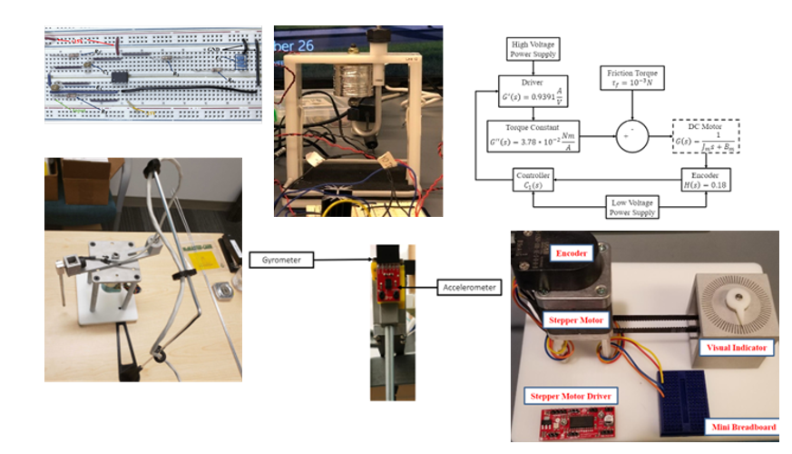

These are the projects as well as the research I did during my M.S. and B.S. periods.
## UMich: Mechatronic System Design Labs and Projects                            
#### Time:  08/2021-12/2021
* Gained comprehensive knowledge of all six labs, including Electronic Circuit (Lab 1), Magnetic Levitation System (Lab 2), DC Motor Servo System (Lab 3), Inverted Pendulum System (Lab 4), Inertial Sensors (Lab 5), and Stepper Motor (Lab 6).
* Successfully assembled hardware components and established circuit connections, showcasing the ability to design a lead controller for Lab 2, a PID controller for Lab 3, and an LQR controller for Lab 4.
* Leveraged Simulink for system simulations in Labs 2, 3, and 4, refining system analysis and design skills.

 

## UMich: Machine Learning (Individual work and team work)                           
#### Time： 09/2021-12/2021
* Conducted a literature review on multi-label learning, analyzed and evaluated five papers, highlighting their algorithmic pros and cons.
* Actively contributed to implementing an image annotation algorithm, thoroughly comprehend paper's algorithm.
* Wrote Python code for dataset feature extraction, optimized the main algorithm code with a teammate, developed code for result visualization.

 

## UMich: An App by Python-Travel Around the US                                  
#### Time:  01/2021-05/2021
* Developed and implemented a travel planning application using Python, incorporating various APIs and packages, including Flask, to enhance user experience and streamline trip planning processes.
* [GitHub link](https://github.com/wqrydqk/SI507_Final_Proj)
* [Demo video link on YouTube](https://www.youtube.com/watch?v=Bso_EGK6IBc)
 

## UMich: Energy Recovery System Modeling and Control    
#### Time:  01/2021-05/2021
* Analyzed existing research findings on ECMS and DP algorithms through a comprehensive literature review.
* Developed and implemented an Energy Consumption Minimization Strategy (ECMS) controller using MATLAB/Simulink, aimed at reducing fuel consumption rates in a vehicle system.
*	Conducted extensive simulations of the vehicle system using Simulink, reduced fuel consumption rates.

 
  
## UM-SJTU: Structure& Control of Lifting Type Installation Plate of Refrigerator Compressor 
#### Time:  05/2020-08/2020
* Designed and engineered the fundamental structures of the lifting device, conducting relevant calculations.
* Utilized 3-D printing technology to fabricate essential components and assembled the lifting mechanism.
* Conducted rigorous testing to ensure the device's functionality, meeting the user requirement of effortless installation plate lifting with a single handle.

 

## MIT Universal Village Program -- The Usage of Sums of Square Methods in Solving Camera Relative Pose Problem
#### Time:  08/2019-09/2019
*	Researched and analyzed existing methods for solving the camera relative pose problem, including the naïve eight-point method, Zhao's convex relaxation method, and Briales's convex relaxation method. Evaluated the strengths and weaknesses of each approach and learned the Sums of Square (SOS) method.
*	Utilized MATLAB to simulate the camera relative pose problem and developed code to implement each method.
*	Conducted in-depth data analysis, highlighting the comparative advantages and disadvantages of each method in relation to the SOS approach. Authored a response paper summarizing the findings.
 

## UM-SJTU: Automatic Robot with Transformable Wheels Based on Double Four-Bar System 
#### Time:  06/2019-08/2019
* Designed precise dimensions for the four-bar linkages and wheel size, creating detailed CAD models and producing components through 3D printing.
* Orchestrated the overall cart structure, ensuring seamless operation while adhering to competition requirements.
* Contributed to Arduino coding and subsequent modifications, enhancing the robot's functionality.

 

## UM-SJTU: Study of Manganese-Based Intelligent Alloys and Corresponding Properties
#### Time:  06/2018-12/2018
* Controlled alloy composition to Mn 85% based on phase diagrams, utilizing CO(NH2)2 as a pore-forming agent, and fabricated samples with varying porosities and pore diameters through solid-state sintering.
*	Calculated porosities and measured pore diameters using mass-volume and surface metallographic methods.
*	Analyzed alloy microstructures, surface topography, compositions, and crystal textures using SEM and XRD.
*	Applied a PATENT for invention.

 

