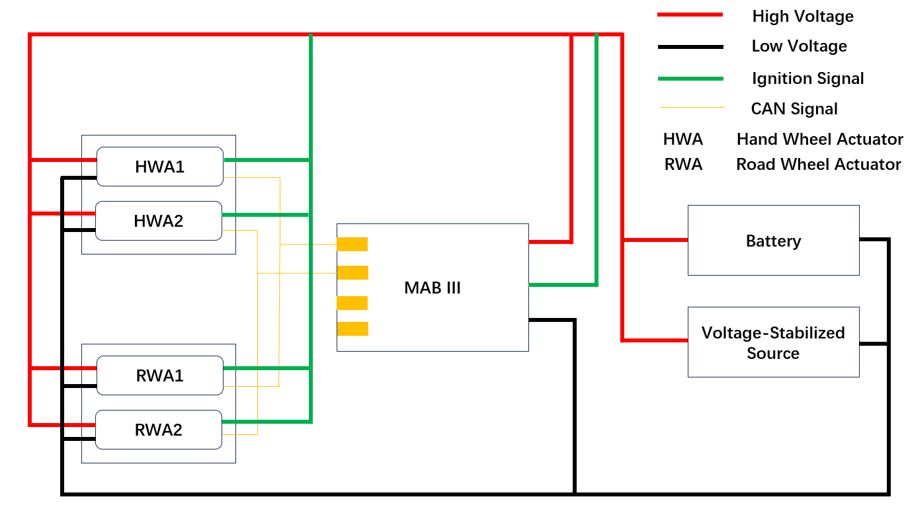
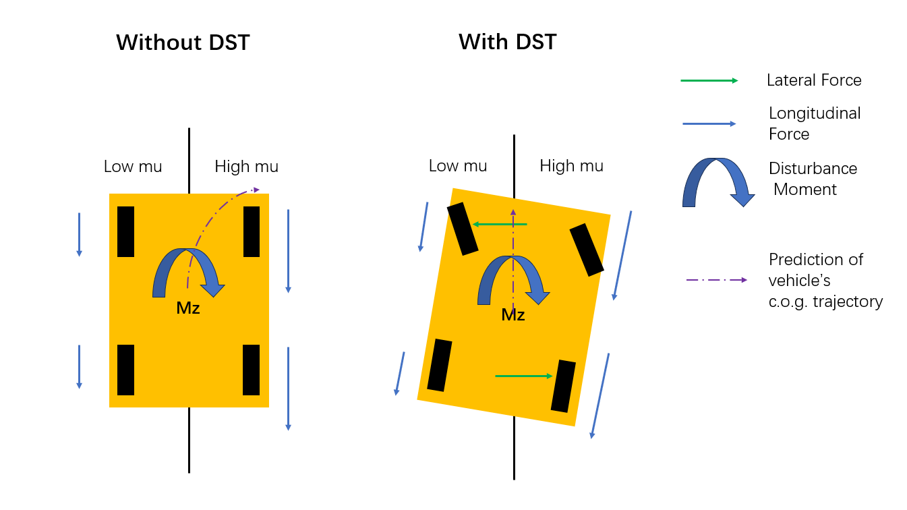

## Li Auto Co. Ltd., Department of Chassis Electronic
### Chassis Electronic Control Engineer, SBW (Steering by Wire) Group   
------
#### Time：06/2022-Present
#### Projects:
* Project 1: SBW Demo Software Development
  * Developed a scene display based on the SBW test bench, incorporating MAB-III and kvaser for sensor data capture, allowed for the visualization of vehicle dynamics using PreScan.
  * Engineered an amplification circuit to enhance sensor electrical signals from brake and accelerator pedals, enabling more precise data collection.
  * Designed and implemented a rack force observer, enhancing feedback on position and velocity through the application of Kalman Filters, which significantly expanded the bandwidth of the original rack force observer.
  * Innovated a high-frequency hand force generation algorithm based on the enhanced rack force observer, leading to a PATENT application.
  * Resolved the long-standing occasional frame loss issue by implementing a complementary filtering algorithm.

 

* Project 2: SBW in Chassis Integration Function: DST (Dynamic Steering Torque)
  * Researched and analyzed the existing mu-estimation algorithm, successfully integrating it into the DST perception function for mu-split road detection.
  * Designed a sophisticated PID controller, incorporating a feed-forward control algorithm within the DST control logic. Leveraged the vehicle's yaw rate as a feedback signal and brake pressure at the cylinders to generate feed-forward signals, optimizing DST performance.
  * Independently executed calibration tasks for DST at a proving ground, including fine-tuning P, I, and D values, and other critical calibration parameters.
  *	Conducted a comprehensive Functional Safety analysis of the DST control system within the SBW framework.

